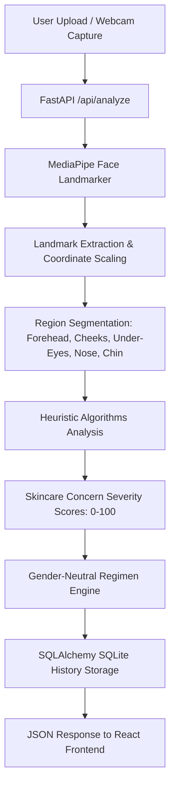

# SkinCV - Technical Documentation

## 1. Project Overview

### Project Title
**SkinCV: Physiology-First Skin Zone Analysis & Regimen Recommendation**

### Team Details
- **Developer**: saran karthick
- **Track**: Computer Vision / Open Challenge (HackZen 2026)

### Problem Statement
Most commercial skincare analysis applications suffer from two critical flaws:
1. **Skin-Tone Bias**: Their machine learning models are implicitly trained on datasets that heavily skew toward lighter skin tones, leading to high false-positive blemish rates or incorrect concern scores on darker skin tones.
2. **Gendered Stereotyping**: Product framing and routine terminology are heavily gendered, creating artificial divisions (e.g. "masculine" vs. "feminine" skin requirements) that ignore basic skin physiology.

### Objective
SkinCV aims to solve these issues by:
- **Heuristic Neutrality**: Replacing biased CNN classifiers with robust, mathematically-calibrated classical computer vision algorithms that analyze color channels and texture relatively (e.g., comparing under-eye darkness directly to the user's own cheek skin tone).
- **Gender-Neutral Regimen**: Crafting a routine recommendations engine focusing purely on clinical active ingredients (like Salicylic Acid, Ceramides, Vitamin C) without gendered copy or product framing.

---

## 2. System Architecture & Methodology



### Region Segmentation
We utilize the modern **MediaPipe Face Landmarker Tasks API** to detect 478 3D facial landmarks. These coordinates are scaled to the image dimensions and grouped into convex polygons corresponding to specific anatomical facial zones:
- **Forehead**: Eyebrow bridge boundaries to hair lines
- **Left / Right Cheeks**: Outer cheek contours representing base skin tone
- **Left / Right Under-Eyes**: Below the lower eyelids
- **Nose**: Bridge and tip of the nose
- **Chin**: Area below the mouth

---

## 3. Concern Scoring Heuristics

Rather than using a black-box neural network trained on a narrow demographic, we use robust classical CV heuristics:

| Concern | Method / Algorithm | Severity Calculation |
| :--- | :--- | :--- |
| **Acne & Blemishes** | LAB color space `a*` (green-red) channel thresholding | Counts local redness peaks that lie $2.5$ standard deviations above the region's average redness, with a minimum offset of 9.5 a* units. Fully relative to the individual's skin tone. |
| **Under-Eye Contrast** | Under-Eye vs. Cheek Luminance comparison | Calculates relative percentage difference in `L*` (luminance) channel between the under-eye region and the cheek region. Renamed from "dark circles" to avoid overclaiming — measures optical contrast, not fatigue. |
| **Pigmentation & Uneven Tone** | Standard Deviation of `L*` channel | Computes color variance across flat regions (forehead and cheeks). Higher deviation indicates hyperpigmentation or uneven tone. |
| **Wrinkles & Fine Lines** | Canny Edge Density inside eroded masks | Applies a Canny filter (thresholds 80, 180) to detect sharp lines. Erodes the region boundaries first to avoid false wrinkle detections from hair or eyelashes. |
| **Oiliness (Shine)** | HSV saturation and brightness highlights | Counts the percentage of pixels in the T-Zone (forehead, nose, chin) with high brightness ($V > 238$) and low saturation ($S < 45$). |
| **Dryness (Roughness)**| Laplacian variance | Computes Laplacian micro-texture variance across flat skin regions. Dryness is computed as a function of roughness offset by specular shine. |

---

## 4. Dataset & Diversity Statement

> [!NOTE]
> **Dataset Limitation & Heuristic Choice**: Many publicly available facial skin datasets (like ACNE04) contain images primarily from a single geographic demographic. Training a deep learning classifier on such data causes it to generalize poorly across Fitzpatrick skin types.
> 
> To bypass this limitation, SkinCV relies on **relative optical heuristics**. For example, dark circles are measured by comparing a user's under-eye luminance *relative to their own cheek luminance*, rather than comparing it to a fixed threshold. This ensures fairness and accuracy regardless of baseline skin tone.

---

## 5. Verification & Sample Output

During automated test runs with a high-resolution portrait test image, the system returned the following calibrated response:

### Sample JSON Output
```json
{
  "scores": {
    "acne": 0,
    "dark_circles": 0,
    "pigmentation": 66,
    "oiliness": 45,
    "dryness": 0,
    "wrinkles": 0
  },
  "routine": [
    {
      "step": "Cleanse",
      "title": "Gentle pH-Balanced Cleanser",
      "ingredients": ["Glycerin", "Allantoin"],
      "description": "A mild, everyday cleanser suitable for maintaining balanced, healthy skin."
    },
    {
      "step": "Treat (Morning)",
      "title": "Brightening Serum",
      "ingredients": ["Vitamin C (L-Ascorbic Acid)", "Alpha Arbutin"],
      "description": "Apply a few drops in the morning before moisturizing to even out skin tone and fade hyperpigmentation."
    },
    {
      "step": "Hydrate",
      "title": "Barrier Support Moisturizer",
      "ingredients": ["Ceramides", "Squalane"],
      "description": "Apply morning and night to seal in moisture and protect the skin barrier."
    },
    {
      "step": "Protect (Morning)",
      "title": "Broad Spectrum SPF 50+",
      "ingredients": ["Zinc Oxide", "Chemical or Mineral UV Filters"],
      "description": "Apply as the final step of the morning routine. Crucial for protecting skin from premature aging, damage, and post-acne dark marks."
    }
  ]
}
```

---

## 6. Robustness & Known Limitations

This section documents what input edge cases are handled, what triggers graceful rejection or a quality warning, and what remains an honest limitation.

### 6.1 Handled Edge Cases (Graceful Rejection or Auto-Correction)

| Scenario | Behavior |
| :--- | :--- |
| **No face detected** | HTTP 400 with message: *"No face detected. Please ensure your face is clearly visible, well-lit, and at a frontal angle."* Frontend displays this as an error banner. |
| **Multiple faces** | Detects up to 4 faces, selects the one with the largest bounding box area, and adds a warning: *"Multiple faces detected (N) — analyzing the largest face."* |
| **Low resolution (<200×200px)** | Rejected before MediaPipe runs with: *"Image resolution too low (WxH). Please upload an image at least 200×200px."* |
| **Invalid file format** | Rejected with: *"Invalid image file format."* |
| **Extreme face angle (>30° yaw / >25° pitch)** | Scores are still returned but **all confidence levels are set to `low`**. Warning: *"Face angle may be too extreme. Scores are provided but confidence is reduced."* The yaw/pitch estimation uses landmark geometry (nose-tip offset from face center, vertical forehead-to-chin ratio). |
| **Overexposed / Underexposed** | Detected via histogram analysis of L* channel within the face region (>15% pixels clipped at 0 or 255). CLAHE auto-correction is applied. Warning banner shown. Confidence downgraded to `medium`. |
| **Color cast (warm/cool lighting)** | Gray-world white balance correction is applied automatically before LAB/HSV analysis to neutralize warm indoor light or blue-tinted screen reflections. |
| **Uneven / directional lighting** | Luminance coefficient of variation is computed across all 7 facial zones. If CV > 0.20, a warning is shown and under-eye contrast confidence is specifically set to `low` (since shadow-based dark circle scoring is most vulnerable). |
| **Flash photography** | Detected by counting small (2–50px), very bright (V>250), low-saturation specular clusters on the face. If ≥3 found, oiliness confidence is set to `low` and a warning is shown. |
| **JPEG compression artifacts (wrinkles)** | A bilateral filter (`cv2.bilateralFilter`) is applied before Canny edge detection to suppress JPEG block noise while preserving genuine edge structure. If the face bounding box height is <200px, wrinkle scoring is skipped entirely (marked low confidence). |
| **Non-face images (landscape, objects)** | MediaPipe returns empty landmarks → handled identically to "no face detected". |
| **Random noise / solid color images** | Same as above — no face landmarks found → graceful rejection. |

### 6.2 Preprocessing Pipeline

Every uploaded image passes through these corrections **before** heuristic analysis:

1. **Gray-World White Balance** — Neutralizes color temperature bias by scaling each BGR channel to equalize the mean.
2. **CLAHE (Contrast Limited Adaptive Histogram Equalization)** — Applied to the L* channel in LAB space with `clipLimit=2.0`, `tileGridSize=8×8` to normalize uneven illumination without introducing artifacts.

### 6.3 Per-Score Confidence System

Every concern score (0–100) is accompanied by a confidence indicator:

| Confidence | Meaning | Visual Badge |
| :--- | :--- | :--- |
| `high` | Good lighting, frontal angle, adequate resolution | Green shield |
| `medium` | Minor quality issues (slight exposure clipping, mild unevenness) | Amber shield |
| `low` | Significant quality issues (extreme angle, flash, severe exposure) | Red shield |

Confidence is independently assessed per concern — for example, flash photography only degrades oiliness confidence, not acne or pigmentation confidence.

### 6.4 Known Limitations (Documented, Not Hidden)

> [!IMPORTANT]
> SkinCV is a **heuristic-based demo tool**, not a clinical diagnostic device. The following are inherent limitations of classical CV approaches operating on single RGB images.

| Limitation | Why It Exists | Impact |
| :--- | :--- | :--- |
| **Sunburn / rosacea / post-exercise flushing** | LAB `a*` channel cannot distinguish transient redness from inflammatory acne. Both manifest as localized redness peaks. | Acne score may be falsely elevated. |
| **Natural under-eye pigmentation** | Some individuals have genetically darker periorbital skin unrelated to fatigue or health. The relative luminance comparison will still flag this as elevated contrast. | Under-eye contrast score reflects optical difference, not pathology. We renamed the label from "dark circles" to "under-eye contrast" to avoid overclaiming. |
| **Makeup / concealer** | Foundation and concealer flatten luminance variance and mask redness, producing artificially "healthy" scores. Conversely, eyeshadow or blush can inflate specific scores. | Scores reflect the analyzed surface, not underlying skin condition. |
| **Glasses frames** | Metal or dark frames crossing the forehead/cheek regions inflate Canny edge density despite mask erosion. | Wrinkle score may be inflated for glasses-wearers. |
| **Hair strands on forehead** | Individual hair strands register as high-frequency edges in the Canny detector, inflating wrinkle density in the forehead zone. | Wrinkle score may be inflated. Hair should be pulled back for best results. |
| **3D pose correction** | We do not perform 3D face frontalization or relighting. We reject extreme angles (>30° yaw) with a confidence warning rather than attempting computational correction. | This is an honest scope boundary — threshold-based rejection is a legitimate engineering decision for a 24h hackathon. |
| **Clinical validation** | No ground-truth dermatological labels have been used to calibrate sensitivity/specificity. Scores are relative indicators, not diagnoses. | Framed as "concern indicators" throughout the UI, not medical assessments. |

### 6.5 Regression Test Suite

A regression test suite (`test_robustness.py`) validates the following boundary conditions:

```
./venv/bin/python test_robustness.py
```

| Test | Input | Expected |
| :--- | :--- | :--- |
| Black image | 400×400 solid black | "No face detected" error |
| Noise image | 400×400 random pixels | "No face detected" error |
| White image | 400×400 solid white | "No face detected" error |
| Small image | 50×50 | "Resolution too low" error |
| Invalid bytes | Raw text bytes | "Invalid image" error |
| Valid portrait | Test portrait | Structured scores with confidence, quality metadata |
| Flat scores compat | Old-format dict | Recommendation engine handles gracefully |

---

## 7. Future Scope
- **Before/After Analysis**: Enabling users to upload two photos to track improvement over time by matching landmark geometry.
- **Enhanced Specular Separation**: Using polarization heuristics or ambient light normalization to improve dryness/oiliness distinction.
- **Multilingual Regimens**: Localizing ingredient descriptions to accommodate regional chemical naming conventions.
- **Occluded Zone Detection**: Using per-landmark visibility scores from MediaPipe to mark individual zones as "not assessed" when covered by masks, hands, or sunglasses, rather than returning a potentially unreliable score.
- **3D Pose Normalization**: Frontalization via 3D Morphable Models to enable reliable analysis at moderate angles without rejection.

