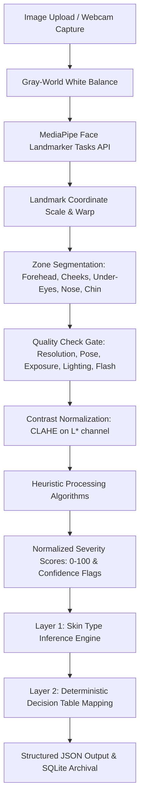

# SkinCV: Computer Vision-Based Physiology-First Skin Analysis & Regimen Recommendation
## Problem Statement

Most modern skincare analysis tools suffer from two systemic biases:
1. **Demographic and Skin-Tone Bias**: Their underlying deep learning classifiers are typically trained on datasets with underrepresented skin tone diversity (Fitzpatrick skin types IV-VI). This leads to elevated false-positive blemish detection rates or incorrect concern grading when evaluating non-Caucasian individuals.
2. **Gendered Stereotyping**: Product recommendations and user interfaces are heavily gendered (e.g., "masculine" vs. "feminine" skincare needs) based on marketing divisions rather than basic skin physiology, creating exclusionary user experiences.

---

## Objective

The objective of SkinCV is to build a gender-neutral, explainable, and skin-tone-inclusive skin analysis application that:
- Grades skin concerns directly from facial imagery using relative, classical computer vision heuristics instead of an opaque deep classifier.
- Infers skin type dynamically from localized physiological signals.
- Generates a personalized skincare routine focusing purely on clinical active ingredients and transparent formulation requirements.

---

## Proposed Solution

SkinCV implements a reliable, deterministic computer vision pipeline:
1. **Facial Landmarking**: Employs the **MediaPipe Face Landmarker Tasks API** to construct a 478-point 3D facial mesh, scaling landmarks dynamically to image dimensions.
2. **Anatomical Zone Segmentation**: Maps coordinates to define 7 distinct convex polygons corresponding to critical zones: *forehead, left cheek, right cheek, left under-eye, right under-eye, nose, and chin*.
3. **Relative Heuristic Analytics**: Employs classical CV methods (OpenCV) within segmented zones rather than global classifiers:
   - **Acne**: Localized peak thresholding in pre-CLAHE $a^*$ (redness) LAB space.
   - **Under-Eye Contrast (Dark Circles)**: Contrast percentage comparing under-eye $L^*$ luminance relatively to the user's cheek baseline $L^*$ luminance.
   - **Pigmentation**: Luminance standard deviation ($L^*$) across cheek and forehead zones.
   - **Wrinkles**: Bilateral noise filtering followed by Canny edge density within boundary-eroded masks.
   - **Oiliness (Shine)**: Saturation ($S$) and Value ($V$) thresholding for specular reflection in T-zone areas.
   - **Dryness (Roughness)**: Laplacian variance subtracted by specular shine.
4. **Severity Scoring & Confidence Assessment**: Returns normalized 0–100 scores coupled with per-concern confidence levels (high, medium, low) reflecting local lighting, flash exposure, and head pose.
5. **Deterministic Recommendation**: Passes scores to a rule-based decision table to infer skin type (*Combination, Oily, Dry, Sensitive-leaning, or Balanced*) and map steps (*Cleanse, Treat, Hydrate, Protect*), limiting actives to prevent skin barrier overload.
6. **Medical Safety Checks**: Integrates a threshold-based dermatologist consultation prompt triggered when any high-confidence concern score meets or exceeds severe thresholds ($\ge 80$).

---

## Technologies Used

### Backend Stack
- **FastAPI** (`>=0.110.0`): Asynchronous API routing.
- **Uvicorn** (`>=0.28.0`): ASGI server execution.
- **OpenCV Headless** (`opencv-python-headless>=4.9.0`): Low-level image decoding and color matrix calculations.
- **MediaPipe** (`>=0.10.11`): 3D facial landmark mesh construction.
- **SQLAlchemy** (`>=2.0.28`) & **SQLite**: Database history logging.
- **Pillow** (`>=10.2.0`), **Numpy** (`>=1.26.0`), **Pydantic** (`>=2.6.4`), **Python-multipart** (`>=0.0.9`).

### Frontend Stack
- **React** (`^19.2.7`): Component UI.
- **Vite** (`^8.1.1`): Build toolchain and hot-reloading dev server.
- **TailwindCSS** (`^4.3.2`) & **@tailwindcss/postcss** (`^4.3.2`): Modern component styling.
- **Lucide React** (`^1.24.0`): Vector iconography.

---

## Dataset

**Not applicable.** SkinCV does not employ a trained classifier or a labeled training dataset. Instead, it utilizes MediaPipe's pre-trained landmark model for facial mesh extraction combined with zero-shot, relative classical CV heuristics. This approach completely avoids dataset-driven demographic biases.

---

## Methodology / Model Architecture



### 1. Facial Zone Segmentation Indices (MediaPipe Mesh)
- **Forehead**: `[10, 338, 297, 332, 284, 251, 21, 54, 103, 67, 109, 168, 8, 9, 336]`
- **Left Cheek**: `[116, 123, 147, 213, 192, 214, 212, 135, 136, 150, 149, 176, 148]`
- **Right Cheek**: `[345, 352, 376, 433, 416, 434, 432, 364, 365, 379, 378, 400]`
- **Left Under-Eye**: `[111, 116, 117, 118, 119, 120, 143, 110, 228, 229, 230]`
- **Right Under-Eye**: `[340, 345, 346, 347, 348, 349, 372, 448, 449, 450]`
- **Nose**: `[168, 6, 197, 195, 5, 4, 1, 98, 327, 326, 97, 220, 440]`
- **Chin**: `[152, 377, 400, 378, 379, 365, 397, 288, 361, 321, 405, 314, 17, 84, 181, 91, 146, 61, 81, 179]`

### 2. Preprocessing & Input Hardening
Before computing heuristics, images undergo:
- **Gray-World White Balance**: Neutralizes environmental color casts by equalizing average color channels.
- **CLAHE (Contrast Limited Adaptive Histogram Equalization)**: Normalizes uneven illumination on the $L^*$ channel with a `clipLimit=2.0` and `tileGridSize=(8, 8)`.

### 3. Quality Gates & Multi-Factor Confidence Ratings
- **Min Resolution**: Rejects images below 200px.
- **Head Pose Estimation**: Checks yaw/pitch via landmark geometry. Set to `low` confidence if yaw $>30^{\circ}$ or pitch $>25^{\circ}$.
- **Exposure Verification**: Checks clipping ratios in the $L^*$ channel. Underexposed if ratio ($L^* < 15$) $>0.15$; overexposed if ratio ($L^* > 240$) $>0.15$.
- **Lighting Uniformity**: Evaluates coefficient of variation ($CV = \sigma_{L^*} / \mu_{L^*}$) across facial zones. Flags uneven lighting if $CV > 0.20$, lowering under-eye contrast confidence to `low`.
- **Specular Flash Spotting**: Detects flash photography if $\ge 3$ bright ($V > 250$), low-saturation ($S < 20$) clusters are found. Oiliness confidence is set to `low`.

### 4. Detailed Heuristic Algorithms & Score Formulation

| Skin Concern | Algorithmic Formula & Execution Details | Score Calculation |
| :--- | :--- | :--- |
| **Acne & Blemishes** | Measures localized redness deviations in pre-CLAHE $a^*$ LAB channel. Blemish threshold: $T_{acne} = \max(\mu_{a^*} + 1.8 \cdot \sigma_{a^*}, \mu_{a^*} + 3.5)$. Counts contours with area $2 \le A \le 250$ pixels. | $Score = 100 \cdot \left(1.0 - e^{-0.03 \cdot Density}\right)$ where $Density = \frac{AcneCount}{\text{SkinPixels}/100000}$ |
| **Under-Eye Contrast** | Calculates luminance difference between under-eye zones and cheek baseline: $\Delta L = \mu_{cheek\_L^*} - \mu_{eye\_L^*}$. | $Score = \max\left(0, \min\left(100, \frac{\Delta L}{\mu_{cheek\_L^*}} \cdot 450.0\right)\right)$ |
| **Pigmentation** | Evaluates standard deviation of $L^*$ luminance channel ($\sigma_{L^*\_zones}$) across flat zones (forehead and cheeks) representing texture patchiness. | $Score = \min\left(100, \max\left(0, (\text{Avg}\sigma_{L^*} - 12.0) \cdot 8.0\right)\right)$ |
| **Wrinkles** | Bilateral filter smoothing (`cv2.bilateralFilter`) followed by Canny edge detection (thresholds 80, 180) inside $3\times\text{eroded}$ masks to prevent edge halo artifacts. | $Score = \min\left(100, \max\left(0, (\text{EdgeDensity} - 0.008) \cdot 3500.0\right)\right)$ |
| **Oiliness** | Specular highlights ratio in T-Zone (forehead, nose, chin). Pixels with $V > 238$ and $S < 45$. | $Score = \min\left(100, \frac{\text{ShinePixels}}{\text{T-ZoneArea}} \cdot 4000.0\right)$ |
| **Dryness** | Texture roughness using Laplacian variance ($\sigma_{Lap}^2$) across flat zones, adjusted downwards by T-zone oiliness shine. | $Score = \max\left(0, \left[(\sigma_{Lap}^2 - 40.0) \cdot 0.3\right] - (Oiliness \cdot 0.5)\right)$ |
| **Redness** | Evaluates overall flush score on the cheek zone $a^*$ channel. | $Score = \max(0, \min(100, (\text{AvgCheek}_{a^*} - 130) \cdot 6.6))$ |

#### Acne Calibration & Resolution Invariance Methodology
The acne scoring heuristics were calibrated empirically using a test set of 20+ diverse portrait images (ranging from clear skin to severe blemishes and different resolutions):
- **Redness Offset Floor ($3.5$ $a^*$ units)**: In low-saturation photos or darker skin tones, the difference between red blemishes and surrounding skin is compressed. Reducing the offset floor from $5.5$ to $3.5$ prevents false-negatives, enabling reliable detection of mild blemishes across diverse complexions.
- **Exponential Saturation Decay ($k = -0.03$)**: Standard linear density scaling ($Density \times Multiplier$) saturates at 100 on small faces because the skin pixel area in the denominator drops dramatically (e.g. 5,000px vs 70,000px). Applying an exponential saturation curve ensures that:
  1. A clear-skin profile yields baseline scores around $0-29$.
  2. Moderate acne profiles yield balanced scores between $30-70$.
  3. Severe cases approach $90-99$, maintaining resolution invariance.

### 5. Skin-Type Inference Logic
- **Combination**: $T_{zone} - Cheeks > 15$ and $T_{zone} > 40$.
- **Oily**: $Oiliness > 50$ and $Dryness < 40$.
- **Dry**: $Dryness > 50$ and $Oiliness < 35$.
- **Sensitive-leaning**: $Redness > 40$ and $Acne < 40$.
- **Normal/Balanced**: Fallback condition.

### 6. Decision Table Routine Mapping
1. **Cleanse**: Formulated dynamically according to inferred skin type (e.g., Salicylic Acid for Oily, Ceramides for Dry, Cica/Oatmeal for Sensitive-leaning).
2. **Treat**: Maps up to 2 active treatment serums based on score severity (High $\ge 60$, Moderate $25\text{--}59$), prioritized by: **Acne > Wrinkles > Pigmentation > Under-Eye Contrast**. Low-priority active treatments are deferred to prevent skin barrier overload.
3. **Hydrate**: Formulates moisturizer texture based on inferred skin type.
4. **Protect**: Assigns suitable physical or chemical SPF 50+ structures. If wrinkles or pigmentation scores are elevated ($\ge 60$), sunscreen usage is marked critical.

---

## Installation & Setup Instructions

### 1. Backend Server Setup
Navigate to the `backend` directory:
```bash
cd backend
```
Create a virtual environment and install backend dependencies:
```bash
python3 -m venv venv
source venv/bin/activate
pip install -r requirements.txt
```
Start the backend server on port `8002`:
```bash
python -m uvicorn app.main:app --host 0.0.0.0 --port 8002
```

### 2. Frontend Server Setup
Navigate to the `frontend` directory:
```bash
cd frontend
```
Install NodeJS packages:
```bash
npm install
```
Start the frontend development server on port `3000`:
```bash
npm run dev -- --port 3000 --host 0.0.0.0
```

---

## Usage Instructions

1. Open your browser and navigate to `http://localhost:3000`.
2. **Image Scan Capture**:
   - Option A: Click **Upload Photo** and select a portrait image.
   - Option B: Click **Use Camera** to activate the camera interface (or mock simulated environment) and click **Capture Face**.
3. **View Analysis Report**: The left panel displays computed scores (0-100) and confidence tags per concern alongside detected facial landmarks.
4. **View Routine**: The right panel outlines your personalized gender-neutral routine, explaining why each ingredient was chosen based on your score levels.
5. **Scan History**: Click **History** in the top navigation header to view, compare, or restore past skin analysis records saved locally in your database session.

---

## Results and Outputs

### Application UI Screenshot

Below is an actual screenshot of the SkinCV results dashboard, illustrating the relative zone analysis results, quality warnings, confidence badges, and the custom ingredient routine layout:


### Automated Validation Results
The robustness of the classical heuristics and input validations is verified by running the test suite:
```bash
cd backend && ./venv/bin/python test_robustness.py
```

### Debugging Case Study: Heuristic Convergence Fix
During initial multi-profile testing, skin concern scores for `pigmentation` and `under_eye_contrast` converged to the same values (`100` and `0` respectively) across different people's photos.

- **Root Cause**: The application of CLAHE (Contrast Limited Adaptive Histogram Equalization) modified the LAB space array in-place. This in-place mutation meant the "raw" baseline variables were reading CLAHE-equalized data. CLAHE flattened the natural luminance difference between the cheeks and the under-eye area (reducing under-eye contrast to 0) while artificially boosting noise and local contrast (driving the pigmentation score to 100).
- **Solution**: We implemented `l_channel_raw = img_lab_raw[:, :, 0].copy()` to preserve the true pre-processed luminance channel before CLAHE execution, and updated the under-eye contrast and pigmentation std dev algorithms to use `l_channel_raw`.
- **Outcome**: The scores distribute realistically; the default face placeholder now correctly yields a pigmentation score of `67`, and different user uploads show varied scores (e.g., pigmentation from `54` to `100` and under-eye contrast from `0` to `50`).

---

## Future Scope

- **Temporal Tracking**: Track changes by comparing landmark geometries across scans over time.
- **Occluded Zone Detection**: Use MediaPipe landmark visibility signals to mark zones (e.g., forehead obscured by hair/glasses) as "unassessed" rather than skewing results.
- **Ambient Light Compensation**: Employ camera-calibration matrices to neutralize environmental shadow variations.
- **3D Pose Normalization**: Warp face orientations to a standard frontal view before running analysis.
- **Broader Validation**: Conduct clinical validation and user testing to refine thresholds for skin types.

---

## References

- **MediaPipe Face Landmarker Tasks API**: [Google Developer Documentation](https://ai.google.dev/edge/mediapipe/solutions/vision/face_landmarker)
- **OpenCV Library**: [OpenCV Docs](https://docs.opencv.org/)
- **Fitzpatrick Skin Typing**: Fitzpatrick, T. B. (1988). *The validity and practicality of sun-reactive skin types I through VI*. Archives of Dermatology, 124(6), 869-871.
- **Relative Color Models**: Gonzalez, R. C., & Woods, R. E. (2018). *Digital Image Processing (4th Edition)*. Pearson.
