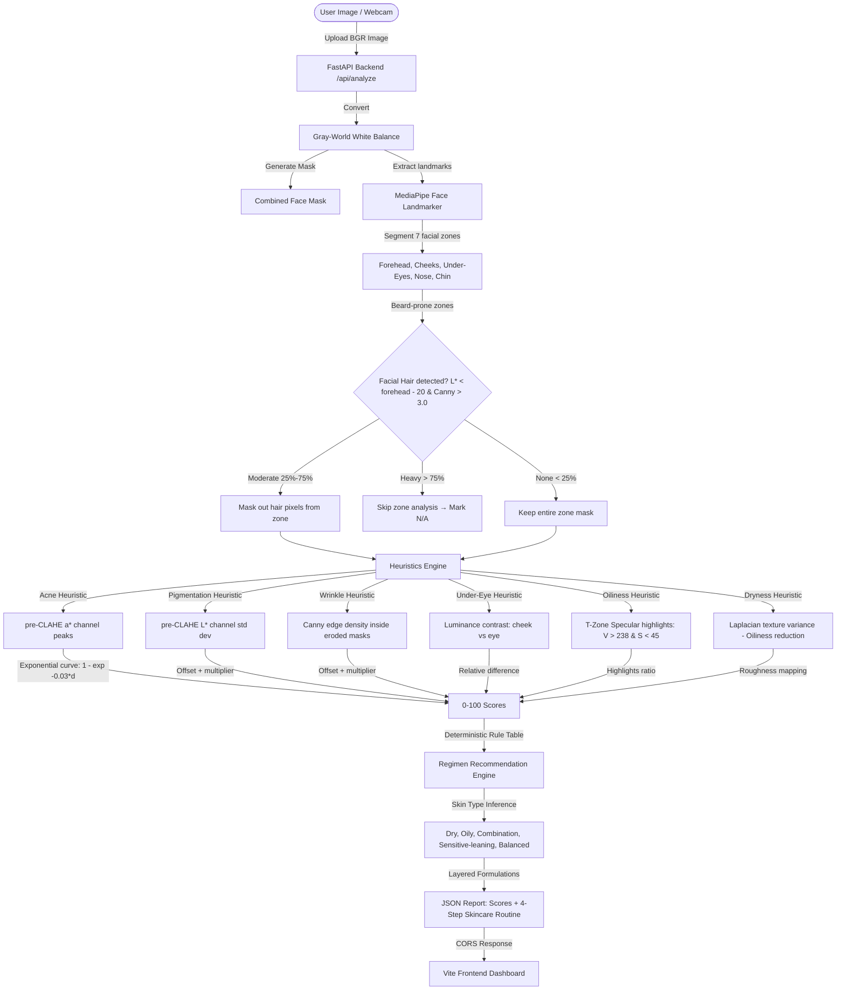

# SkinCV: Computer Vision-Based Physiology-First Skin Analysis & Regimen Recommendation

SkinCV is a physiology-first facial skin concern analysis and personalized skincare routine recommendation system. Built for the **HackZen 2026 Open Challenge** (Computer Vision track), SkinCV rejects black-box neural networks in favor of explainable, relative optical heuristics and inclusive, gender-neutral designs.

---

## 🚀 Tech Stack

- **Computer Vision & Processing**:
  - Google MediaPipe Face Landmarker Tasks API (468-point 3D facial topology mapping)
  - OpenCV (Image analysis, color space conversions, thresholding, Canny filters)
  - NumPy (Matrix mathematics, standard deviations, and percentile calculations)
- **Backend Service**:
  - FastAPI (High-performance ASGI Python framework)
  - SQLite (Local database storage)
  - SQLAlchemy (Python SQL toolkit and Object Relational Mapper)
  - Uvicorn (ASGI web server implementation)
- **Frontend Dashboard**:
  - React (User Interface components)
  - Vite (Frontend build tool and dev server)
  - Vanilla CSS / TailwindCSS (Fluid layouts, dark mode, responsive styling)
  - Lucide Icons (System iconography)

---

## 🏛️ Architecture



---

## 📂 Project Structure

```
hackzen-2026/
├── backend/
│   ├── app/
│   │   ├── __init__.py
│   │   ├── cv_analysis.py       # MediaPipe segmentation & classical CV heuristics
│   │   ├── database.py          # SQLite database connection setup
│   │   ├── main.py              # FastAPI application entrypoint & API endpoints
│   │   ├── models.py            # SQLite database models (Analysis History)
│   │   └── recommendation.py    # Deterministic skincare regimen engine
│   ├── uploads/                 # Local directory saving uploaded portrait scans
│   ├── requirements.txt         # Python dependencies
│   ├── skincv.db                # SQLite database file
│   └── test_robustness.py       # Robustness & validation test suite
├── docs/
│   ├── DOCUMENTATION.md         # Detailed sub-documentation on CV & logic
│   └── zone_debug.png           # Visual zone segmentation reference
├── frontend/
│   ├── src/
│   │   ├── components/
│   │   │   ├── FaceAnalyzer.jsx # Camera/Webcam interface and file uploader
│   │   │   ├── ResultsDisplay.jsx # Renders score cards & confidence bars
│   │   │   └── RoutineDisplay.jsx # Renders personalized 4-step skincare recommendations
│   │   ├── App.jsx              # Main UI layout and state manager
│   │   └── index.css            # Core styles, animations, and Tailwind styling
│   ├── package.json             # Node dependencies
│   └── vite.config.js           # Vite configuration
├── DOCUMENTATION.md             # Project documentation for HackZen submission
└── README.md                    # Project README introduction (this file)
```

---

## ⚙️ Installation & Setup Instructions

### Prerequisites
- Python 3.9+ installed
- Node.js 18+ and npm installed

### 1. Backend Server Setup
1. Navigate to the `backend` directory:
   ```bash
   cd backend
   ```
2. Create a virtual environment and install backend dependencies:
   ```bash
   python3 -m venv venv
   source venv/bin/activate  # On Windows use: venv\Scripts\activate
   pip install -r requirements.txt
   ```
3. Start the backend server on port `8002`:
   ```bash
   python -m uvicorn app.main:app --host 0.0.0.0 --port 8002
   ```

### 2. Frontend Server Setup
1. Open a new terminal window and navigate to the `frontend` directory:
   ```bash
   cd frontend
   ```
2. Install node dependencies:
   ```bash
   npm install
   ```
3. Start the Vite dev server on port `3000`:
   ```bash
   npm run dev -- --port 3000 --host 0.0.0.0
   ```

Open your browser to `http://localhost:3000` to interact with SkinCV.
